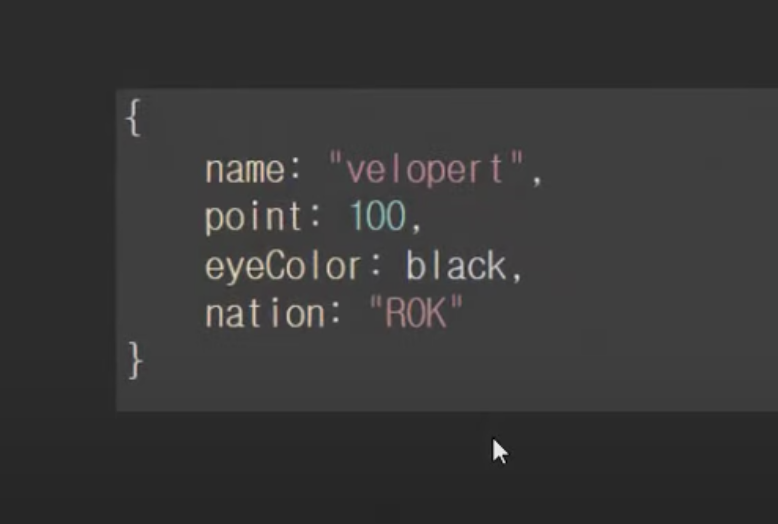

# 강좌 1-2편: React.js 소개

React는 프레임워크가 아니라 라이브러리입니다.

프레임워크는 필요한 기능들이 이미 대부분 만들어 져있어서 위와 같이 틀이 있고
안에 를 채우면서 완성하는 것이고 이틀에서 벗어나기 힘듭니다.

가끔씩은 다른 프레임워크를 같이 사용할때 충돌이 나는 경우도 있고

필요하지 않은 것들이 이미 구현되어 있습니다.

반면 라이브러리는 필요한 곳에 가져다 쓰면 되는 개념입니다. 다른 라이브러리랑

충돌 할 일이 없다.

리엑트는 유저 인터페이스를 만들기 위한 라이브러리 입니다.

컨트롤러, ajax, route 기능들을 내장하고 있지 않아서 가볍습니다.

하지만 Angular를 대체할 수 없습니다. angular는 프레임워크입니다.

참고로 react native -> 모바일 네이티브 앱을 리엑트로 만들수 있게 해주는 프레임워크 입니다.

## Virtual DoM
리엑트 라이브러리의 핵심은 가상돔을 사용하는 것입니다. 

실제 돔을 직접 처리하는 것은 관리하기 힘듭니다. 사실 위와 같은 처리는 상관없지만
처리해야할 데이터가 많을 경우 관리하기 힘듭니다. 반면  Virtual DoM은 이를 추상화 시킨 것으로써 자바스크립트의 객체에 불과합니다. 그안에서 처리를 하는 것은
이미 랜더링된 html을 실제 DOM api를 사용하는 것보다 훨씬 빠릅니다.

예를 들어서

이러한 데이터세트가 주어지고 값이 업데이트 될때마다 userinterface를 업데이트 한다고 생각하면 html에서 어떤 요소를 수정해야할 지 정의하고 바뀐 값을 기존값과 일일이 변경해야 합니다. 그래서 리엑트는 이과정들을 편리하게 해줍니다. 

 # 강좌 1-3편: React.js 장점

   - Virtual DoM 를 사용한다는 것
   - react js 배우기 쉽다.
   - 코드를 분리시키지않고 컴포넌트 하나로 관리합니다.
   - GC가 있습니다.
   - 서버 & 클라이언트 랜더링 지원 (초기 구동 딜레이 & seo (검색엔진최적화))   
   - UI를 컴포넌트화                                                     
   - 다른 프레임워크나 라이브러리와 혼용가능
   
# 강좌 단점
   - view only
   - 자바스크립트 배경지식이 없으면 조금 힘듭니다.
   - IE8 이하 지원 X
   

# 강좌 1-4편: React.js

컴포넌트는 자스 클래스입니다. 그리고 리엑트 컴포넌트를 상속한다.
그러면 코드랩이라는 컴포넌트를 만들 것입니다.

class 는 es6에서 도입된 문법
생성자 매소드가 있습니다.

this는 호출하는 방법에 대해서 결정됩니다.
this 는 호출한 객체가 this 이다. 그리고 그 this를 호출과 무관하게 묶어줄 수 있는 애가 bind이다.

- 출처 : https://www.youtube.com/watch?v=H24D0GveBYY&list=PL9FpF_z-xR_GMujql3S_XGV2SpdfDBkeC&index=2

